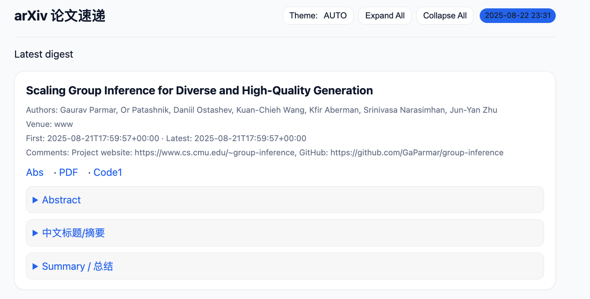
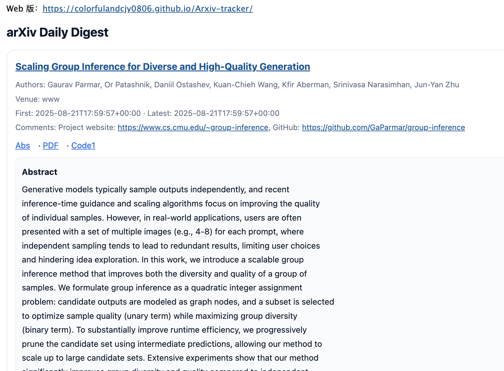

# Arxiv-tracker · Daily arXiv Paper Tracker

[](https://github.com/colorfulandcjy0806/Arxiv-tracker/stargazers)
[](../../actions)
[](https://colorfulandcjy0806.github.io/Arxiv-tracker/)


[](./LICENSE)

> **If you like this project, please give it a ⭐ star for the latest updates!**  

**[简体中文](./README_CN.md) | English**

---

## 😮 Highlights

- 🔎 **Multi-field, multi-topic search**: categories like `cs.CV / cs.LG / cs.AI / cs.CL`; free-form keywords; `logic: AND/OR` controls the relation between the *category-set* and the *keyword-set*
- 🧠 **Bilingual LLM summaries**: one English + one Chinese paragraph, or **two-stage** (TL;DR + Method Card + Discussion)
- 🔗 **Auto links**: abstract / PDF / code repo / project page
- 📨 **Email delivery**: QQ SMTP (465/SSL or 587/STARTTLS), multi-recipient
- 🌐 **Web page (GitHub Pages)**: nice HTML site with archive & collapse/expand
- ♻️ **Freshness + Dedup**: only push papers that are *fresh* and *not sent before*; write `seen.json` **after successful output** to keep idempotency
- 📦 **OpenAI-Compatible LLM**: **DeepSeek / SiliconFlow** supported via the same config (one `base_url` + one `api_key`)
- 🔁 **Auto pagination**: avoid always taking the same first N results

**Preview (web):**  


**Preview (email):**  


---

## 📰 News

- **2025-08-25**
  - Added **Freshness + persistent dedup** (write to `seen.json` only after a successful output).
  - Added **OpenAI-Compatible LLM**: besides DeepSeek, now works with **SiliconFlow** (e.g., `Qwen/Qwen3-8B`).
  - Fixed a bug that **could send duplicate emails**; added Actions **concurrency guard** and a **manual-send toggle**.
  - Introduced **auto pagination** to avoid reusing the same batch.
- **2025-08-22**: First public release (search → summarize/translate → email/web).

---

## 🧭 Repository Layout

```
arxiv_tracker/        # Core logic (client, parser, summarizer, site, mailer)
docs/                 # GitHub Pages output (auto-generated)
outputs/              # Per-run JSON/MD (auto-generated)
.state/               # Dedup state (seen.json, recommend committing it)
.github/workflows/    # digest.yml (daily 03:00 Beijing time)
config.yaml           # Search / summary / email / site / dedup config
requirements.txt      # Dependencies
```

---

## 🚀 Quick Start (Fork & Deploy)

### 1) Fork

Click **Fork** on the top-right.

### 2) Configure Secrets & Variables

> Settings → **Secrets and variables** → **Actions**

**Secrets**

- `OPENAI_COMPAT_API_KEY`: API key for any OpenAI-compatible provider (e.g., **DeepSeek**, **SiliconFlow**)
- `SMTP_PASS`: QQ **SMTP App Password** (not your login password)

**Variables**

- `EMAIL_TO`: Recipients (comma/semicolon separated)
- `EMAIL_SENDER`: Sender email (usually equals SMTP user)
- `SMTP_USER`: SMTP username (usually the same as sender)

### 3) Enable GitHub Pages

Settings → **Pages** → Source: **Deploy from a branch**; Branch `main`, Folder `/docs`.

### 4) Workflow (Support manual triggering of whether to send a message. The code has already written it, so this step can be omitted and run directly)

Example `digest.yml` (excerpt):

```yaml
name: arxiv-digest

on:
  workflow_dispatch:
    inputs:
      send_email:
        description: "Send email for manual run?"
        required: false
        default: "false"
        type: choice
        options: ["false", "true"]
  schedule:
    - cron: "0 19 * * *"  # 19:00 UTC = 03:00 Beijing next day

concurrency:
  group: arxiv-digest
  cancel-in-progress: true

jobs:
  build:
    runs-on: ubuntu-latest
    permissions:
      contents: write
    steps:
      - uses: actions/checkout@v4

      - uses: actions/setup-python@v5
        with: { python-version: "3.10" }

      - name: Install deps
        run: |
          python -m pip install --upgrade pip
          pip install -r requirements.txt

      - name: Compute Pages URL
        id: site
        run: |
          REPO="${GITHUB_REPOSITORY}"
          OWNER="${REPO%%/*}"
          NAME="${REPO#*/}"
          echo "url=https://${OWNER}.github.io/${NAME}/" >> $GITHUB_OUTPUT

      - name: Run tracker (schedule-only email unless forced)
        env:
          OPENAI_COMPAT_API_KEY: ${{ secrets.OPENAI_COMPAT_API_KEY }}
          EMAIL_TO:     ${{ secrets.EMAIL_TO   || vars.EMAIL_TO }}
          EMAIL_SENDER: ${{ secrets.EMAIL_SENDER || vars.EMAIL_SENDER }}
          SMTP_USER:    ${{ secrets.SMTP_USER  || vars.SMTP_USER }}
          SMTP_PASS:    ${{ secrets.SMTP_PASS }}
        run: |
          set -e
          EXTRA="--no-email"
          if { [ "${{ github.event_name }}" = "schedule" ] && [ "${{ github.run_attempt }}" = "1" ]; } || \
             { [ "${{ github.event_name }}" = "workflow_dispatch" ] && [ "${{ inputs.send_email }}" = "true" ]; }; then
            EXTRA=""
          fi
          python -m arxiv_tracker.cli run \
            --config config.yaml \
            --site-dir docs \
            --site-url "${{ steps.site.outputs.url }}" \
            $EXTRA \
            --verbose

      - name: Commit outputs
        uses: stefanzweifel/git-auto-commit-action@v5
        with:
          commit_message: "chore: update digest & site"
          file_pattern: |
            docs/**
            outputs/**
            .state/**
```

**Configuration process is as follows:**


> **Note**: include `.state/**` in `file_pattern` to persist dedup state across runs.

---

## ⚙️ Configuration (`config.yaml`)

```yaml
# === Search ===
categories: ["cs.CV", "cs.LG", "cs.AI"]
keywords:
  - "open vocabulary segmentation"
  - "vision-language grounding"
logic: "AND"                 # categories (OR) combined with keywords (OR) by AND/OR
max_results: 100             # per-page cap; the runner auto-paginates internally
sort_by: "lastUpdatedDate"   # or submittedDate
sort_order: "descending"

# === Output language ===
lang: "both"                 # zh / en / both

# === Summaries ===
summary:
  mode: "llm"                # none / heuristic / llm
  scope: "both"              # tldr / full / both

# === LLM (OpenAI-Compatible: DeepSeek / SiliconFlow) ===
llm:
  base_url: "https://api.deepseek.com"     # or "https://api.siliconflow.cn"
  model: "deepseek-chat"                   # e.g., "Qwen/Qwen3-8B" for SiliconFlow
  api_key_env: "OPENAI_COMPAT_API_KEY"
  system_prompt_en: |
    You are a senior paper-reading assistant...
  system_prompt_zh: |
    你是资深论文阅读助手...

# === Optional: CN translation for title/abstract ===
translate:
  enabled: true
  lang: "zh"
  fields: ["title", "summary"]

# === Email (QQ SMTP example) ===
email:
  enabled: true
  subject: "[arXiv] Daily Digest"
  smtp_server: "smtp.qq.com"
  smtp_port: 465
  tls: "ssl"                 # auto / ssl / starttls
  debug: false
  detail: "full"
  max_items: 10
  attach_md: true
  attach_pdf: false

# === Site (GitHub Pages) ===
site:
  enabled: true
  dir: "docs"
  title: "arXiv Daily"
  keep_runs: 1024
  theme: "light"
  accent: "#2563eb"

# === Freshness & Dedup (write after success) ===
freshness:
  since_days: 3
  unique_only: true
  state_path: ".state/seen.json"
  fallback_when_empty: false
```

> **Query semantics**: within `categories` we OR; within `keywords` we OR; then join the two sets with `logic` (AND/OR). Example: `logic: AND` means *in these categories* **and** *match these keywords*.

---

## 🛠️ Run Locally (macOS/Linux)

```bash
python -m venv .venv && source .venv/bin/activate
python -m pip install --upgrade pip
pip install -r requirements.txt

export OPENAI_COMPAT_API_KEY="your_api_key"
# base_url/model are in config.yaml
export EMAIL_TO="your@qq.com"
export EMAIL_SENDER="your@qq.com"
export SMTP_USER="your@qq.com"
export SMTP_PASS="your_qq_smtp_app_password"

python -m arxiv_tracker.cli run --config config.yaml --site-dir docs --verbose
```

### Windows (PowerShell)

```powershell
python -m venv .venv; .\.venv\Scripts\Activate.ps1
python -m pip install --upgrade pip
pip install -r requirements.txt

$Env:OPENAI_COMPAT_API_KEY = "your_api_key"
$Env:EMAIL_TO     = "your@qq.com"
$Env:EMAIL_SENDER = "your@qq.com"
$Env:SMTP_USER    = "your@qq.com"
$Env:SMTP_PASS    = "your_qq_smtp_app_password"

python -m arxiv_tracker.cli run --config config.yaml --site-dir docs --verbose
```

---

## ❓ FAQ

- **Results look stale / empty?**  
  Auto pagination + freshness filter + post-success dedup are enabled. If a day is empty, try temporarily increasing `since_days` to 2–3; also check if your keywords are too narrow.
- **401 Unauthorized (SiliconFlow/DeepSeek)**  
  Ensure `OPENAI_COMPAT_API_KEY` is a valid key for the provider you configured.
- **ReadTimeout (arXiv API)**  
  Likely network hiccups; just retry later.
- **No email received**  
  Check “Show email env (masked)” in Actions logs; ensure QQ SMTP app password is used and TLS/port matches your settings.
  
---

##  🗺️  To-do list

- [x] Solve the problem of retrieving the same literature every day
- [x] Bug of sending 2 emails each time
- [x] Support more LLMs, next step to consider silicon-based flow APIs
- [ ] More site themes (dark color, following system)
- [ ] Custom card field switch and order

## ✨ Star History

[](https://star-history.com/#colorfulandcjy0806/Arxiv-tracker&Date)

---

## 🤝 Community contributors

<a href="https://github.com/colorfulandcjy0806/Arxiv-tracker/graphs/contributors">
  
</a>

## 🔒 License

MIT — see [LICENSE](./LICENSE).
